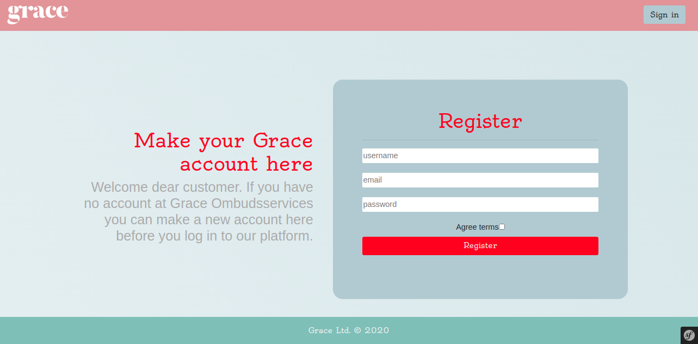
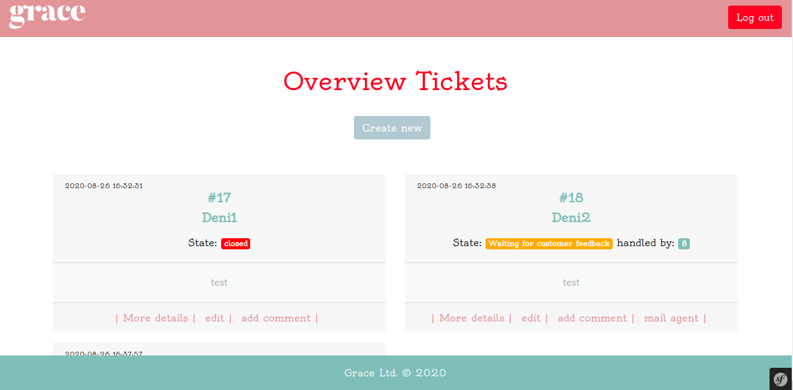
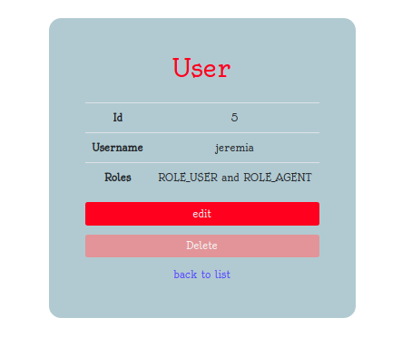
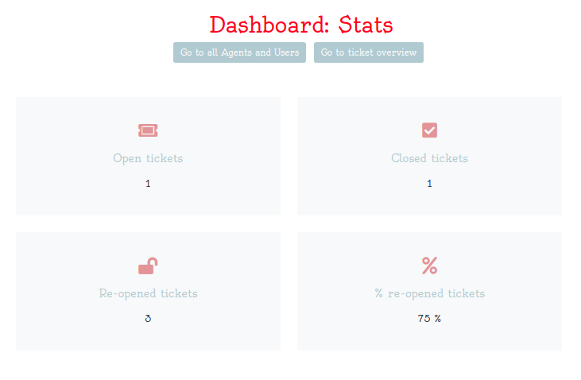

# Call-center

PHP Symfony group project using Doctrine ORM, MVC, Twig & dependency injection

- Repository: `call-center`
- Type of Challenge: `Consolidation Challenge`
- Duration: `5 days`
- Deployment strategy : `heroku`
- Team challenge : `Deni Khalikov (logic), Jeremia Verhulst (logic & styling), Laura Devriendt (main logic & styling), Yoann Stas (styling concept) & Yuri Franken (logic & styling)`

## The Mission
A big part of development is workflow implementation to automate processes in the real world.

Implementation of the workflow of a call center. 

We have 5 different users in our system that have different abilities:

### Guest
- Can register himself to become a Customer.
- Can login to become another role (based on credentials)
- Provide a "forgot my password" functionality

### Customer
- A customer can create a ticket on the site. It get's the status "open".
- The customer can see all open tickets that he created and comment on them.
- If the customer responds to a ticket with status "Waiting for customer feedback" mail the agent and change the status again to "in progress".
- A customer can reopen a ticket if it has been closed for less than 1 hour.

### Agent
- First line agents can see all open tickets and assign one to themselves. It now get's the status "in progress".
- Agents can leave comments on a ticket which can be public (the customer can see the comment and react) or private (invisible for customer)
- If the agent leaves a public comment mark the ticket "Waiting for customer feedback"
- First line agents can "escalate a ticket" to "second line" help.
- An agent can close a ticket if it has at minimum one agent comment (to explain the solution to the customer).

### Second line agent
- Second line agents can do everything a first line agent can do, but only for escalated tickets.

### Manager
- A manager can create new agents or change the details of an agent (first or second line help). When a new agent is created sent a welcome e-mail to the agent, with a link where the agent can configure his password. You could reuse logic of the "forgot my password" guest flow here.
- Provide a dashboard where managers can see statistics about the agents:
    - Number of open tickets
    - Number of closed tickets
    - Number of tickets that where reopened
    - A percentage comparision between the 2 numbers above.
- A manager can re-assign tickets or mark them as "won't fix". In the last case the ticket is considered closed and cannot be opened by the customer later on. You should provide a required field to enter a reason for the manager why he will not fix it.

- Managers can with one button de-assign all tickets, they once again get the status "open".
They normally do this at the end of every working day to prevent tickets being locked by an agent who is sick the next day.
- Managers can assign priorities, on which the tickets should be sorted.

### General rule
- Every time a ticket is updated (comment, status change) you have to mail the customer EXCEPT when a private comment is made.
